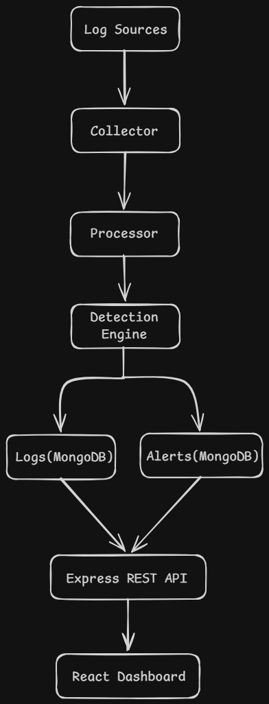

# SentinelSIEM - System Overview

## Introduction

SentinelSIEM is a lightweight, modular, open-source Security Information and Event Management (SIEM) platform designed for educational purposes and portfolio demonstration.

The project aims to simulate the core functionality of enterprise SIEM solutions by collecting security logs, parsing and normalizing events, detecting suspicious activity, storing security events, and presenting them through a web dashboard.

## Objectives

-   Understand SIEM architecture
-   Build modular cybersecurity software
-   Implement detection engineering concepts
-   Learn secure backend development
-   Demonstrate cloud-ready architecture

---

## High-Level Architecture

---

## Components

### Collector

Responsible for receiving or generating logs.

Responsibilities:

-   Generate sample logs
-   Receive logs from different sources
-   Pass raw logs to the Processor

---

### Processor

Converts raw log text into structured JSON.

Responsibilities:

-   Parse logs
-   Normalize fields
-   Validate log format

---

### Detection Engine

Analyzes structured logs using security rules.

Responsibilities:

-   Detect brute force attacks
-   Detect suspicious logins
-   Generate alerts

---

### Database

Stores processed logs and alerts.

Collections:

-   logs
-   alerts
-   rules
-   users

---

### Backend API

Provides REST endpoints.

Examples:

GET /logs

GET /alerts

POST /rules

GET /stats

---

### Frontend Dashboard

Allows analysts to monitor events.

Features:

-   Dashboard
-   Log Viewer
-   Alert Viewer
-   Analytics
-   Rule Management

---

## Data Flow

1. Log source creates a security event.

2. Collector receives the event.

3. Processor converts it into structured JSON.

4. Detection Engine evaluates the event.

5. Alerts are generated if rules match.

6. Data is stored in MongoDB.

7. Backend exposes REST APIs.

8. Dashboard displays results.

---

## Future Enhancements

-   Docker deployment
-   Kubernetes support
-   AWS CloudTrail ingestion
-   Sigma rule compatibility
-   Threat Intelligence integration
    <<<<<<< HEAD
-   # Machine Learning anomaly detection
-   Machine Learning anomaly detection
    > > > > > > > feature/log-generator
